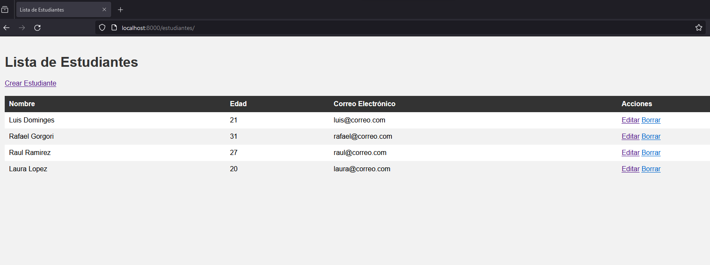

# Software 

Table of Contents
=================

* [Proyecto de Estudiantes](#Proyecto-de-estudiantes)
* [Configuración del Proyecto](#configuracion-del-proyecto)
* [Configuración de Django ](#configuracion-de-django)
* [Funcionalidades del Proyecto ](#funcionalidades-del-proyecto)

## Proyecto de Estudiantes

Este es un proyecto que muestra un sistema para gestionar estudiantes utilizando las tecnologías Flask y Django.

## Configuración del Proyecto
Crea un entorno virtual para el proyecto:
```
$ python3 -m venv env
```
Activa el entorno virtual:
En Windows:
```
$ myenv\Scripts\activate
```
Para instalar los las librerias neceserias se puede usar el comando 
```
$ pip install -r requirements.txt
```
Inicia el servidor de desarrollo de Flask:
```
$ flask db init
$ flask db migrate
$ flask db upgrade

$ flask run
```
Accede al proyecto en tu navegador web en la dirección 
```
http://localhost:5000/usuarios
```


## Configuración de Django

Para ejecutar la interfaz necesitas otra terminal y colocar
```
$ python manage.py runserver
```
Accede al proyecto en tu navegador web en la dirección 
```
http://localhost:8000/estudiantes/
```

## Funcionalidades del Proyecto

El proyecto consta de las siguientes funcionalidades:

- **Lista de Estudiantes**: Muestra una lista de todos los estudiantes registrados en la base de datos. Permite ver los detalles de cada estudiante, editar la información y eliminar estudiantes.
- **Crear Estudiante**: Permite agregar un nuevo estudiante al sistema. Debe proporcionarse el nombre completo, la edad y el correo electrónico del estudiante.
- **Editar Estudiante**: Permite modificar la información de un estudiante existente. Se puede actualizar el nombre completo, la edad y el correo electrónico.
- **Eliminar Estudiante**: Permite eliminar un estudiante de la base de datos.

## Estructura del Proyecto

El proyecto está organizado de la siguiente manera:

- **proyecto**: Contiene la implementación de Flask, incluyendo modelos, rutas, controladores y pruebas unitarias.
- **interfaz**: Contiene la implementación de Django, incluyendo modelos, vistas y plantillas.

Tambien se incluye un ejemplo en Postman para tener un ejemplo de los endpoints.

